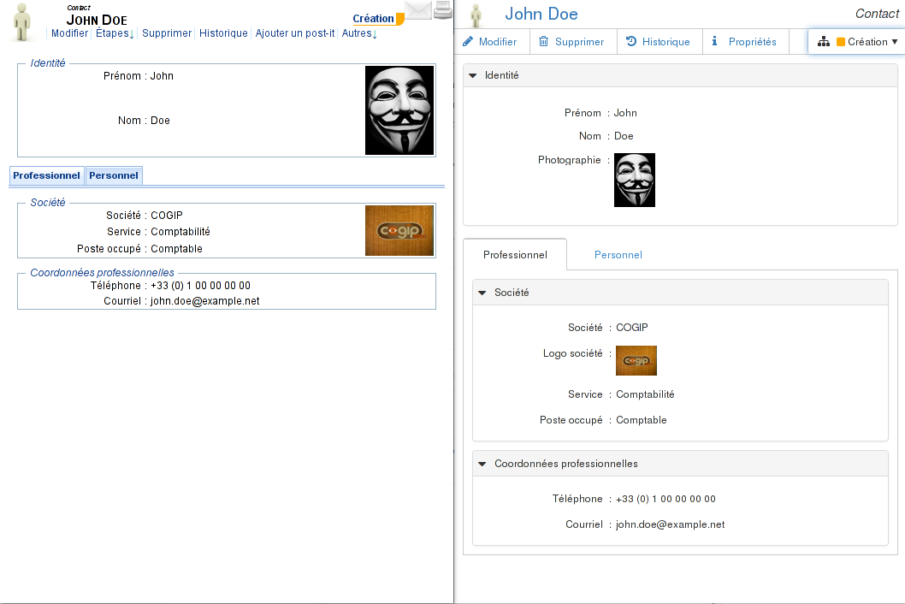

# Découverte de Dynacase Document UIs {#ddui-qs:240c8ae1-aa60-4e5b-a5d2-2872685b1389}

## Qu'est-ce que Dynacase Document UIs {#ddui-qs:a555fcf9-0e04-485a-b422-8ff6db16ad67}

Dynacase Document UIs est un module Dynacase permettant de générer une représensation des documents au moyen des
technologies HTML5.

Le rendu des documents sans ce module est fait par le serveur, sous la forme d'une page HTML4 _monolithique_.
Dynacase Document UIs permet à la génération de se faire côté client au moyen de Javascript, HTML5 et CSS.

Cela apporte les avantages suivants :

-   Répartition de la charge entre les clients
    
    Puisque le serveur n'envoie plus que les données, et ne construit plus la page, cela allège la charge du serveur.

-   Souplesse
    
    Puisque le rendu est fait en javascript au dernier moment, il est facile de prendre en compte des éléments de
    contexte, et de faire un rendu extrêmement personnalisé.

-   Comportement surchargeable
    
    De par cette souplesse, il devient très facile de surcharger le comportement du document pour implémenter des
    fonctionnalités avancées (telles que le _wizard_ que nous verrons dans un [prochain chapitre][chapter_wizard], ou encore le fonctionnement en mode déconnecté).

 Pour une présentation plus détaillée de Dynacase Document UIs,
se reporter au [manuel de référence][ddui-ref]

## L'application de gestion des contacts {#ddui-qs:c94cafba-0750-49d5-a179-8d5055cd5d7b}

Au cours de ce tutoriel, nous allons construire une application de gestion des contacts.

Cette application sera composée des éléments Dynacase suivants :

-   La famille _Contact_
    +   soumise à un workflow à 2 étapes
        *   À jour
        *   À mettre à jour
    +   pilotée par un wizard (chaque étape permettra de mettre à jour une partie de la fiche)
    +   avec une mise ne page responsive
-   Une interface de navigation, permettant de
    +   afficher la liste des contacts
    +   rechercher parmi les fiches contact
    +   afficher plusieurs fiches au moyen d'onglets

## Mise en œuvre de Dynacase Document UIs {#ddui-qs:476eb3bb-79b7-4848-b1dd-792ef5455074}

### Récupération des sources {#ddui-qs:7436d855-2dc9-4aec-aa11-995db2ece57a}

Les sources avant cette étape correspondent au [tag `step-20-00`][step-20-00].

### Code {#ddui-qs:c3f52086-083b-42e6-9729-92d868f82298}

L'étape de départ de ce tutoriel contient déjà la famille (avec son workflow), ainsi que le contact _John Doe_.
Dans un premier temps, nous allons travailler directement sur le document.

Il suffit donc de déployer les sources.

### Déploiement {#ddui-qs:66a49812-9544-4578-924b-22d9c0fcbe60}

Les sources telles que déployées à cette étape correspondent au [tag `step-20-00`][step-20-00]

Le déploiement se fait au moyen du _developer toolkit_
(pour plus d'explications sur les outils de développement, se rendre sur [leur documentation][devtools-ref]) :

-   pour linux :
    
        php dynacase-devtool.phar deploy -u localhost -p 8080 -c dynacase -s path/to/sources --auto-release

-   pour windows :
    
        dynacase-devtool.bat deploy -u localhost -p 8080 -c dynacase -s path/to/sources --auto-release

### Le résultat {#ddui-qs:fc37ec8c-df21-41b0-993a-556bba7f7752}

Il est possible de consulter le document

-   dans sa __représentation standard__ à l'adresse
    [http://localhost:8080/?app=FDL&action=FDL_CARD&latest=Y&id=CONTACT_JOHN_DOE](http://localhost:8080/?app=FDL&action=FDL_CARD&latest=Y&id=CONTACT_JOHN_DOE)
-   dans sa __représentation HTML5__ à l'adresse
    [http://localhost:8080/api/v1/documents/CONTACT_JOHN_DOE.html](http://localhost:8080/api/v1/documents/CONTACT_JOHN_DOE.html)

Pour plus d'explications sur l'application `DOCUMENT`, voir [le manuel de référence ddui][ddui-ref-app-document]

## Comparaisons entre la représentation traditionnelle et la représentation HTML5 {#ddui-qs:50c4190e-cdae-4384-b2fd-0a066263b055}

Si vous connaissiez Dynacase avant la sortie de Dynacase Document UIs, voici les éléments clés différenciant
la représentation traditionnelle et la représentation HTML5.

-   La représentation HTML5 utilise [Bootstrap][bootstrap] pour sa mise en page.
    
    Cela amène une présentation plus moderne, et plus espacée.
    
    De plus, les documents sont responsive par défaut :
    en dessous de 480px, les libellés passent au dessus des attributs.
    
-   Les menus ont été revus

-   Le changement d'état se fait depuis un menu sur l'état courant (à droite de la barre de menus)

-   En modification, les attributs sont construits au moyen de la version open source de la librairie
    [Kendo UI][kendo-ui-opensource].
    
    Cela amène une meilleure homogénéité des différents types d'attributs, ainsi qu'une plus grande souplesse.

Au-delà de ces aspects visuels, chaque attribut a été construit de manière à ce que
ses éléments soient facilement adressables par CSS, facilement surchargeables au moyen de JavaScript.
Nous allons exploiter cette nouvelle souplesse dans les chapitres suivants.

<!-- links -->
[ddui-ref]:                 #ddui-ref:
[ddui-ref-app-document]:    #ddui-ref:f38f3995-1b3f-4b43-bacc-2516015e3ea
[devtools-ref]:             #devtools:
[chapter_wizard]:           #ddui-qs:d0e9dddc-6336-4cc9-ac82-97cd72bfd0d4
[step-20-00]:               https://github.com/Anakeen/dynacase-ddui-quickstart-code/archive/step-20-00.zip
[bootstrap]:                http://getbootstrap.com/
[kendo-ui-opensource]:      http://www.telerik.com/kendo-ui/open-source-core
