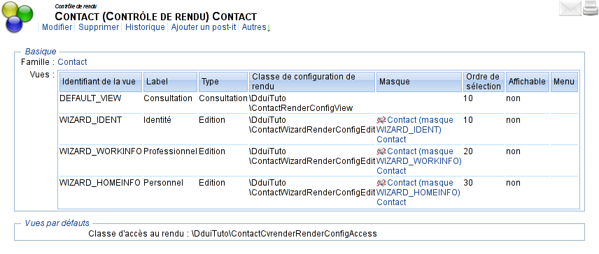

# Conception d'un assistant (_wizard_) avec Dynacase Document UIs {#ddui-qs:d0e9dddc-6336-4cc9-ac82-97cd72bfd0d4}

## Principe {#ddui-qs:d4a896b1-6100-4bbd-a1b7-b8ca670c1dc6}

Le wizard permet de découper la saisie du document en plusieurs étapes.
Chaque étape définira un ensemble de conditions pour pouvoir passer à l'étape suivante.

Chaque étape sera implémentée au moyen d'une vue, accompagnée d'un masque.
Ces vues seront pilotées au moyen d'un [contrôle de rendu][ddui-ref_controle-rendu],
et d'une [classe d'accès à un rendu][ddui-ref_renderaccessclass].

La dernière étape atteinte sera mémorisée dans un paramètre applicatif du document.

La partie serveur sélectionnera la vue en se basant sur les informations envoyées par le client
au moyen des [`customClientData`][ddui-ref_customClientData].

Pendant le wizard, le document sera à l'état `Création`.

À la fin du wizard, le document sera passé à l'état `À jour`.

L'état `Création` ne sera plus accessible après achèvement du wizard.

Voici à quoi ressemblera le document pendant le wizard :

Les étapes seront les suivantes :

-   Identité
-   Professionnel
-   Personnel

## Mise en œuvre du wizard {#ddui-qs:ef47f74a-852b-4c64-bd02-2e6ec42609ae}

### Mise en place des vues {#ddui-qs:860783d6-52c0-4bba-b241-88de1227dd2d}

3 vues vont être ajoutées sur le contrôle de rendu.
Le contrôle de rendu va également préciser une classe d'accès à un rendu,
qui va déterminer la vue suivante en fonction de :

-   la vue en cours (transmise par le client)
-   les vues accessibles à cet utilisateur (calculé au moyen des droits sur le serveur)
-   la vue demandée (_précédent_, _suivant_, ou une vue spécifique, demandée par le client)

#### Récupération des sources {#ddui-qs:ce5b29aa-58a9-46fd-8521-267938eebdd4}

Les sources avant cette étape correspondent au [tag `step-40-00`][step-40-00].

#### Code {#ddui-qs:dc1398f3-e752-458b-a391-ede6fa38baac}

Chaque vue sera composée de :

-   un masque de saisie,
-   une [classe de rendu][ddui-ref_classe-rendu],

De plus, le contrôle de rendu sera associé à une [classe d'accès à un rendu][ddui-ref_renderaccessclass].

Ces éléments doivent donc être initialisés avant création du contrôle de rendu.

Nous allons donc commencer par initialiser notre classe de rendu, commune aux 3 nouvelles vues :

[`DDUI_TUTO/Families/DDUI_TUTO_CONTACT/ContactWizardRenderConfigEdit.php`](https://github.com/Anakeen/dynacase-ddui-quickstart-code/blob/step-40-09/DDUI_TUTO/Families/DDUI_TUTO_CONTACT/ContactWizardRenderConfigEdit.php "Télécharger le fichier complété") :

    [php]
    <?php
    
    namespace DduiTuto;
    
    class ContactWizardRenderConfigEdit extends \Dcp\Ui\DefaultEdit
    {
    
    }

Nous allons ensuite initialiser la classe d'accès à un rendu dans le fichier
[`DDUI_TUTO/Families/DDUI_TUTO_CONTACT/ContactCvrenderRenderConfigAccess.php`](https://github.com/Anakeen/dynacase-ddui-quickstart-code/blob/step-40-10/DDUI_TUTO/Families/DDUI_TUTO_CONTACT/ContactCvrenderRenderConfigAccess.php "Télécharger le fichier complété") :

    [php]
    <?php
    
    namespace DduiTuto;
    
    use Dcp\Ui\IRenderConfig;
    use Dcp\Ui\IRenderConfigAccess;
    
    class ContactCvrenderRenderConfigAccess implements IRenderConfigAccess
    {
        /**
         * @param string $mode
         *
         * @return IRenderConfig
         */
        public function getRenderConfig($mode, \Doc $document)
        {
            return null;
        }
    }

Nous allons également initialiser les 3 masques qui seront utilisés par chacune des vues.
Chaque masque peut être initialisé à l'adresse suivante :
http://localhost:8080/?app=GENERIC&action=GENERIC_EDIT&classid=MASK&msk_famid=DDUI_TUTO_CONTACT

Une fois exportés, et correctement ajoutés au fichier [`DDUI_TUTO/Families/DDUI_TUTO_CONTACT/DDUI_TUTO_CONTACT__DATA.csv`](https://github.com/Anakeen/dynacase-ddui-quickstart-code/blob/step-40-10/DDUI_TUTO/Families/DDUI_TUTO_CONTACT/DDUI_TUTO_CONTACT__DATA.csv "Télécharger le fichier complété"), il peuvent être déployés.

Il est maintenant possible de rajouter nos 3 vues dans le contrôle de rendu,
à l'adresse http://localhost:8080/?app=FDL&action=OPENDOC&mode=view&id=DDUI_TUTO_CONTACT__CVRENDER.
Les vues sont donc maintenant au nombre de 4 :

-   `DEFAULT_VIEW`
    +   Identifiant de la vue : `DEFAULT_VIEW`
    +   Label : `Consultation`
    +   Type : `Consultation`
    +   Classe de configuration de rendu : `\DduiTuto\ContactRenderConfigView`
    +   Masque : vide
    +   Ordre de sélection : `10`
    +   Affichable : `Non`
    +   Menu : vide
-   `WIZARD_IDENT`
    +   Identifiant de la vue : `WIZARD_IDENT`
    +   Label : `Identité`
    +   Type : `Edition`
    +   Classe de configuration de rendu : `\DduiTuto\ContactWizardRenderConfigEdit`
    +   Masque : `Contact (masque WIZARD_IDENT) Contact`
    +   Ordre de sélection : `10`
    +   Affichable : `Non`
    +   Menu : vide
-   `WIZARD_WORKINFO`
    +   Identifiant de la vue : `WIZARD_WORKINFO`
    +   Label : `Professionnel`
    +   Type : `Edition`
    +   Classe de configuration de rendu : `\DduiTuto\ContactWizardRenderConfigEdit`
    +   Masque : `Contact (masque WIZARD_WORKINFO) Contact`
    +   Ordre de sélection : `20`
    +   Affichable : `Non`
    +   Menu : vide
-   `WIZARD_HOMEINFO`
    +   Identifiant de la vue : `WIZARD_HOMEINFO`
    +   Label : `Personnel`
    +   Type : `Edition`
    +   Classe de configuration de rendu : `\DduiTuto\ContactWizardRenderConfigEdit`
    +   Masque : `Contact (masque WIZARD_HOMEINFO) Contact`
    +   Ordre de sélection : `30`
    +   Affichable : `Non`
    +   Menu : vide

Une fois exporté, et correctement ajouté au fichier
[`DDUI_TUTO/Families/DDUI_TUTO_CONTACT/DDUI_TUTO_CONTACT__DATA.csv`](https://github.com/Anakeen/dynacase-ddui-quickstart-code/blob/step-40-10/DDUI_TUTO/Families/DDUI_TUTO_CONTACT/DDUI_TUTO_CONTACT__DATA.csv "Télécharger le fichier complété"),
il peut être déployé.

#### Déploiement {#ddui-qs:d95c0bd9-ca98-43c0-9918-b423daa9522d}

Les sources telles que déployées à cette étape correspondent au [tag `step-40-10`][step-40-10]

Le déploiement se fait au moyen du _developer toolkit_
(pour plus d'explications sur les outils de développement, se rendre sur [leur documentation][devtools-ref]).

La commande est donc :

-   pour linux :
    
        php dynacase-devtool.phar deploy -u localhost -p 8080 -c dynacase -s path/to/sources --auto-release

-   pour windows :
    
        dynacase-devtool.bat deploy -u localhost -p 8080 -c dynacase -s path/to/sources --auto-release

#### Le résultat {#ddui-qs:4642aa2a-a191-470a-aec5-13786a481999}

En accédant au contact _John DOE_ en modification à l'adresse [http://localhost:8080/?app=DOCUMENT&initid=CONTACT_JOHN_DOE&viewId=!defaultEdition](http://localhost:8080/?app=DOCUMENT&initid=CONTACT_JOHN_DOE&viewId=!defaultEdition),
nous constatons que seul le cadre _identité_ est présenté.
En effet, notre classe d'accès à un rendu retourne null, laissant le contrôle de rendu afficher sa vue par défaut,
c'est à dire la première vue de modification.

### Partie serveur : choix de la vue {#ddui-qs:38340484-07b8-46a5-abdd-6ba6faa1100e}

La partie serveur sélectionnera la vue en se basant sur les informations suivantes,
envoyées par le client au moyen des [`customClientData`][ddui-ref_customClientData] :

`currentWizardStepName`
:    le nom de l'étape en cours
    
    Si ce nom est vide, alors on sélectionne la dernière vue atteinte
    (mémorisée au moyen d'un paramètre applicatif),
    et la première vue si le paramètre applicatif n'est pas renseigné.

`goto`
:   Une consigne sur l'étape à atteindre, parmi :
    
    `wizard.previous`
    :   Indique que l'utilisateur veut revenir vers l'étape précédente.
    
    `wizard.next`
    :   Indique que l'utilisateur veut aller vers l'étape suivante.
    
    `wizard.targetStep`
    :   Indique que l'utilisateur veut accéder à une étape spécifique.
        
        Dans ce cas, l'étape en question est passée par le paramètre `targetStep`.

#### Récupération des sources {#ddui-qs:e73b9df2-0f20-4310-a231-5bbe45241c51}

Les sources avant cette étape correspondent au [tag `step-40-10`][step-40-10].

#### Code {#ddui-qs:e5e186b3-9d88-4675-94b2-3f5967a0bb4e}

On ajoute la méthode `initWizardInfos` à la classe `ContactWizardRenderConfigEdit` dans le fichier
[`DDUI_TUTO/Families/DDUI_TUTO_CONTACT/ContactWizardRenderConfigEdit.php`](https://github.com/Anakeen/dynacase-ddui-quickstart-code/blob/step-40-20/DDUI_TUTO/Families/DDUI_TUTO_CONTACT/ContactWizardRenderConfigEdit.php "Télécharger le fichier complété").
Cette méthode récupère les données envoyées par le client, et stocke les informations sur les vues dans la propriété
`wizardInfos`. Elle va également déterminer la vue à appliquer, et la stocker également dans cette propriété :

    [php]
    <?php
    
    namespace DduiTuto;
    
    use Dcp\AttributeIdentifiers\cvrender as CvrenderAttributes;
    use Dcp\Family\Cvrender as CvrenderFamily;
    
    class ContactWizardRenderConfigEdit extends \Dcp\Ui\DefaultEdit
    {
        protected $wizardInfos;
    
        public function initWizardInfos(\Doc $document, $force = false) {
            if($force || is_null($this->wizardInfos)) {
                $wizardSteps = [];
                $wizardCurrentStepKey = 0;
                $wizardNextStep = null;
                $goto = null;
                $wizardTags = $document->getUTag('wizard');
                if(false === $wizardTags) {
                    $wizardTags = [];
                } else {
                    $wizardTags = json_decode($wizardTags->comment, true);
                }
    
                $customClientData = \Dcp\Ui\Utils::getCustomClientData();
                if (isset($customClientData['currentWizardStepName'])) {
                    $currentWizardStepName = $customClientData['currentWizardStepName'];
                } else {
                    if(isset($wizardTags['currentWizardStepName']))
                    {
                        $currentWizardStepName = $wizardTags['currentWizardStepName'];
                    } else {
                        $currentWizardStepName = null;
                    }
                }
    
                // get the list of wizard views
                $wizardViews = $this->getWizardViews($document);
    
                if (isset($customClientData['goto']) && 'wizard.targetStep' === $customClientData['goto']) {
                    $currentWizardStepName = $customClientData['targetStep'];
                }
    
                foreach ($wizardViews as $key => $wizardView) {
                    $wizardView['attributes'] = $this->getWizardViewAttributes(
                        $document,
                        $wizardView[CvrenderAttributes::cv_mskid]
                    );
    
                    $wizardSteps[] = $wizardView;
                    if ($wizardView[CvrenderAttributes::cv_idview] === $currentWizardStepName
                    ) {
                        $wizardCurrentStepKey = $key;
                    }
                }
                $nbSteps = count($wizardSteps);
    
                if (isset($customClientData['goto'])) {
                    switch($customClientData['goto']) {
                    case 'wizard.previous':
                        if(0 < $wizardCurrentStepKey) {
                            $wizardCurrentStepKey--;
                        }
                    break;
                    case 'wizard.next':
                        if ($nbSteps-1 > $wizardCurrentStepKey) {
                            $wizardCurrentStepKey++;
                        }
                    }
                }
    
                $wizardSteps[$wizardCurrentStepKey]['current'] = true;
    
                $wizardTags['currentWizardStepName']
                    = $wizardSteps[$wizardCurrentStepKey][CvrenderAttributes::cv_idview];
                $wizardTags['currentWizardStepLabel']
                    = $wizardSteps[$wizardCurrentStepKey][CvrenderAttributes::cv_lview];
                $document->addUTag($document->getSystemUserId(), 'wizard', json_encode($wizardTags));
    
                $document->setMask(
                    $wizardSteps[$wizardCurrentStepKey][CvrenderAttributes::cv_mskid]
                );
    
                $this->wizardInfos = [
                    "steps" => $wizardSteps,
                    "previousStep" => (isset($wizardSteps[$wizardCurrentStepKey - 1])
                        ? $wizardSteps[$wizardCurrentStepKey - 1]
                        : null),
                    "currentStep" => $wizardSteps[$wizardCurrentStepKey],
                    "nextStep" => (isset($wizardSteps[$wizardCurrentStepKey + 1])
                        ? $wizardSteps[$wizardCurrentStepKey + 1]
                        : null),
                    "nbSteps" => $nbSteps
                ];
            }
        }
    
        protected function getWizardViews(\Doc $document)
        {
            $wizardViews = [];
    
            $cvId = $document->getPropertyValue('cvid');
            /** @var CvrenderFamily $cvDoc */
            $cvDoc = new_Doc('', $cvId, true);
            if ($cvDoc->isAlive()) {
                $cvDoc->set($document);
    
                $wizardViews = $cvDoc->getArrayRawValues(
                    CvrenderAttributes::cv_t_views
                );
    
                $wizardViews = array_filter(
                    $wizardViews,
                    function ($value) {
                        return "WIZARD_" === substr(
                            $value[CvrenderAttributes::cv_idview], 0, 7
                        );
                    }
                );
    
                usort(
                    $wizardViews,
                    function ($value1, $value2) {
                        if ($value1[CvrenderAttributes::cv_order]
                            === $value2[CvrenderAttributes::cv_order]
                        ) {
                            return 0;
                        }
                        return ($value1[CvrenderAttributes::cv_order]
                            < $value2[CvrenderAttributes::cv_order]) ? -1 : 1;
                    }
                );
            }
    
            return $wizardViews;
        }
    
        protected function getWizardViewAttributes(\Doc $contact, $mskId)
        {
            $fields = [];
            $frames = [];
            $initMid = $contact->getPropertyValue('mid');
            if($mskId !== $initMid){
                $contact->setMask($mskId);
    
                foreach ($contact->getNormalAttributes() as $attribute) {
                    if ('W' === $attribute->mvisibility
                        || 'O' === $attribute->mvisibility
                    ) {
                        $fields[$attribute->ordered] = [
                            'attrid' => $attribute->id,
                            'required' => $attribute->needed,
                            'label' => $attribute->getLabel(),
                            'type' => $attribute->type,
                            'filled' => trim($contact->getRawValue($attribute->id)) !== ""
                        ];
                    }
                }
    
                foreach ($contact->getFieldAttributes() as $attribute) {
                    if ($attribute->type === 'frame'
                        && ('W' === $attribute->mvisibility
                            || 'O' === $attribute->mvisibility)
                    ) {
                        $frames[] = [
                            'attrid' => $attribute->id,
                            'label' => $attribute->getLabel()
                        ];
    
                    }
                }
                $contact->setMask($initMid);
            }
    
            return [
                'frames' => array_values($frames),
                'fields' => array_values($fields),
                'nbFields' => count($fields)
            ];
        }
    }

Nous pouvons maintenant définir cette configuration de rendu comme étant
la configuration de rendu à utiliser pour les vues de création et de modification.
Cela se fait dans la classe `ContactCvrenderRenderConfigAccess` du fichier
[`DDUI_TUTO/Families/DDUI_TUTO_CONTACT/ContactCvrenderRenderConfigAccess.php`](https://github.com/Anakeen/dynacase-ddui-quickstart-code/blob/step-40-20/DDUI_TUTO/Families/DDUI_TUTO_CONTACT/ContactCvrenderRenderConfigAccess.php "Télécharger le fichier complété") :

    [php]
    <?php
    
    namespace DduiTuto;
    
    use Dcp\Ui\IRenderConfig;
    use Dcp\Ui\IRenderConfigAccess;
    use Dcp\Ui\RenderConfigManager;
    
    class ContactCvrenderRenderConfigAccess implements IRenderConfigAccess
    {
        /**
         - @param string $mode
         - @param \Doc   $document
         *
         - @return IRenderConfig
         */
        public function getRenderConfig($mode, \Doc $document)
        {
            switch($mode) {
            case RenderConfigManager::ViewMode:
                //let the CV RENDER do the job
                return null;
            default:
                $wizardRenderConfig = new ContactWizardRenderConfigEdit();
                $wizardRenderConfig->initWizardInfos($document);
                return $wizardRenderConfig;
            }
        }
    }

#### Déploiement {#ddui-qs:40c77e5d-ced1-4289-8665-1f004939a7be}

Les sources telles que déployées à cette étape correspondent au [tag `step-40-20`][step-40-20]

Le déploiement se fait au moyen du _developer toolkit_
(pour plus d'explications sur les outils de développement, se rendre sur [leur documentation][devtools-ref]).

La commande est donc :

-   pour linux :
    
        php dynacase-devtool.phar deploy -u localhost -p 8080 -c dynacase -s path/to/sources --auto-release

-   pour windows :
    
        dynacase-devtool.bat deploy -u localhost -p 8080 -c dynacase -s path/to/sources --auto-release

#### Le résultat {#ddui-qs:5af86030-8a8e-459d-b9b1-81253dd13a7e}

En accédant au contact _John DOE_ en modification à l'adresse [http://localhost:8080/?app=DOCUMENT&initid=CONTACT_JOHN_DOE&viewId=!defaultEdition](http://localhost:8080/?app=DOCUMENT&initid=CONTACT_JOHN_DOE&viewId=!defaultEdition),
nous constatons que seul le cadre _identité_ est présenté.
En effet, en l'absence de données du client, la première vue est sélectionnée et appliquée.

### Partie serveur : mise en place du header {#ddui-qs:e8c8da50-268a-4cbb-9707-7c4deb90d6d2}

Le menu va être surchargé au moyen d'un template personnalisé
pour afficher les différentes étapes du wizard au dessus du menu.

#### Récupération des sources {#ddui-qs:976b1bbc-e387-43be-a343-342236feaa58}

Les sources avant cette étape correspondent au [tag `step-40-20`][step-40-20].

#### Code {#ddui-qs:d289942c-1a9b-4638-854f-6adc02865b0c}

Le template utilisé est le suivant, à enregistrer dans le fichier
[`DDUI_TUTO/Families/DDUI_TUTO_CONTACT/Layout/contactWizardHeader.mustache`](https://github.com/Anakeen/dynacase-ddui-quickstart-code/blob/step-40-30/DDUI_TUTO/Families/DDUI_TUTO_CONTACT/Layout/contactWizardHeader.mustache "Télécharger le fichier complété") :

    [html]
    [[#wizardInfos]]
[[#steps]]
        

            
[[cv_lview]]
            

            
[[#attributes]][[#fields]]
                

                

                [[/fields]][[/attributes]]
            

        

    [[/steps]]
[[/wizardInfos]]
    <nav class="dcpDocument__menu"></nav>

La css correspondante, à enregistrer dans le fichier
[`DDUI_TUTO/Families/DDUI_TUTO_CONTACT/Layout/wizard.css`](https://github.com/Anakeen/dynacase-ddui-quickstart-code/blob/step-40-30/DDUI_TUTO/Families/DDUI_TUTO_CONTACT/Layout/wizard.css "Télécharger le fichier complété"),
est la suivante :

    [css]
    .wizard_summary__step {
        float: left;
        padding: 2px 0px;
        text-align: center;
        cursor: pointer;
    }
    
    .wizard_summary__step::before {
        content: "\f054"; /* fa-chevron-right */
        font-size: 2em;
        font-family: FontAwesome;
        font-style: normal;
        font-weight: normal;
        float: right;
        vertical-align: middle;
        width: 30px;
        text-align: center;
        color: green;
    }
    
    .wizard_summary__step:first-child {
        padding-left: 5px;
    }
    
    .wizard_summary__step:last-child {
        padding-right: 5px;
    }
    
    .wizard_summary__step:last-child::before {
        content: "\f024"; /* fa-flag */
    }
    
    .wizard_summary__step_optional_unfilled::before {
        color: orange;
    }
    
    .wizard_summary__step_required_unfilled::before {
        color: red;
    }
    
    .wizard_summary__step:hover,
    .wizard_summary__step:active {
        font-style: italic;
        text-decoration: underline;
    }
    
    .wizard_summary__step_current {
        background-color: WhiteSmoke;
    }
    
    .wizard_summary__step__label {
        font-weight: bold;
        font-size: 120%;
        padding: 3px;
    }
    
    .wizard_summary__step__label_current {
        font-style: italic;
    }
    
    .wizard_summary__step__attributes {
        width: calc(100% - 30px);
        float: left;
    }
    
    .wizard_summary__step__attribute {
        height: 3px;
        background-clip: content-box;
        float: left;
        padding: 0 2px;
        background-color: orange;
    }
    
    .wizard_summary__step__attribute_required {
        background-color: red;
    }
    
    .wizard_summary__step__attribute_filled {
        background-color: green;
    }

Enfin, 3 méthodes sont surchargées dans la classe `ContactWizardRenderConfigEdit` dans le fichier
[`DDUI_TUTO/Families/DDUI_TUTO_CONTACT/ContactWizardRenderConfigEdit.php`](https://github.com/Anakeen/dynacase-ddui-quickstart-code/blob/step-40-30/DDUI_TUTO/Families/DDUI_TUTO_CONTACT/ContactWizardRenderConfigEdit.php "Télécharger le fichier complété") :

[`getCssReferences`][ddui-ref_getCssReferences]
:   injecte le fichier css précédemment créé.

[`getTemplates`][ddui-ref_getTemplates]
:   remplace le menu par le template précédemment créé.

[`getContextController`][ddui-ref_getContextController]
:   injecte les propriétés de wizardInfos dans le moteur de template pour compléter le bandeau de navigation.

Soit :

    [php]
    public function getContextController(\Doc $document)
    {
        $this->initWizardInfos($document);
    
        $controller = parent::getContextController($document);
        $controller["wizardInfos"] = $this->wizardInfos;
        return $controller;
    }
    
    public function getTemplates(\Doc $document = null)
    {
        $this->initWizardInfos($document);
    
        $templates = parent::getTemplates($document);
    
        $templates["sections"]["menu"]["file"]
            = "DDUI_TUTO/Families/DDUI_TUTO_CONTACT/Layout/contactWizardHeader.mustache";
    
        return $templates;
    }
    
    public function getCssReferences(\Doc $document = null)
    {
        $version = \ApplicationParameterManager::getParameterValue(
            "CORE", "WVERSION"
        );
    
        $cssReferences = parent::getCssReferences($document);
    
        $cssReferences['DDUI_TUTO_CONTACT_WIZARD']
            = "DDUI_TUTO/Families/DDUI_TUTO_CONTACT/Layout/wizard.css?ws="
            . $version;
    
        return $cssReferences;
    }

#### Déploiement {#ddui-qs:43a0a228-070d-4f9c-897f-f60215bafaf3}

Les sources telles que déployées à cette étape correspondent au [tag `step-40-30`][step-40-30]

Le déploiement se fait au moyen du _developer toolkit_
(pour plus d'explications sur les outils de développement, se rendre sur [leur documentation][devtools-ref]).

La commande est donc :

-   pour linux :
    
        php dynacase-devtool.phar deploy -u localhost -p 8080 -c dynacase -s path/to/sources --auto-release

-   pour windows :
    
        dynacase-devtool.bat deploy -u localhost -p 8080 -c dynacase -s path/to/sources --auto-release

#### Le résultat {#ddui-qs:f3a62e88-2c97-4fb6-97e2-f25564c10da6}

En accédant au contact _John DOE_ en modification à l'adresse [http://localhost:8080/?app=DOCUMENT&initid=CONTACT_JOHN_DOE&viewId=!defaultEdition](http://localhost:8080/?app=DOCUMENT&initid=CONTACT_JOHN_DOE&viewId=!defaultEdition),
nous constatons que le bandeau de navigation entre les différentes étapes est maintenant visible.

### Partie serveur : Personnalisation du menu {#ddui-qs:ae07c2ce-3037-4215-bfb5-893814f8bc96}

Les entrées de menu vont être surchargées :

-   certaines seront masquées
-   les entrées permettant la navigation dans le wizard seront ajoutées

#### Récupération des sources {#ddui-qs:17c70b7a-baf9-406a-965c-0681cf9f36f9}

Les sources avant cette étape correspondent au [tag `step-40-30`][step-40-30].

#### Code {#ddui-qs:7cab3997-c721-481e-869b-81b31172f5fe}

La méthode [`getMenu`][ddui-ref_getMenu] est surchargée dans la classe `ContactWizardRenderConfigEdit` dans le fichier
[`DDUI_TUTO/Families/DDUI_TUTO_CONTACT/ContactWizardRenderConfigEdit.php`](https://github.com/Anakeen/dynacase-ddui-quickstart-code/blob/step-40-40/DDUI_TUTO/Families/DDUI_TUTO_CONTACT/ContactWizardRenderConfigEdit.php "Télécharger le fichier complété") :

    [php]
    public function getMenu(\Doc $document)
    {
        $this->initWizardInfos($document);
    
        $menu = parent::getMenu($document);
    
        //Hide some menus
        foreach(['save', 'saveAndClose', 'create', 'createAndClose', 'close', 'workflow'] as $elementId) {
            $element = $menu->getElement($elementId);
            if (!is_null($element)) {
                $element->setVisibility(ElementMenu::VisibilityHidden);
            }
        }
    
        //add custom menus
        $item = new ItemMenu(
            "wizard_end", ___("End creation", "ddui_tuto:wizard"),
            "#action/wizard.end"
        );
        $item->setBeforeContent('
');
        $item->setHtmlAttribute("class", "menu--right");
        if (!empty($this->wizardInfos['nextStep'])) {
            $item->setVisibility($item::VisibilityHidden);
        }
        $item->useConfirm(___("Confirm end creation", "ddui_tuto:wizard"));
        $menu->appendElement($item);
    
        $item = new ItemMenu(
            "wizard_next", ___("Next step", "ddui_tuto:wizard"),
            "#action/wizard.next"
        );
        $item->setBeforeContent('
');
        $item->setHtmlAttribute("class", "menu--right");
        if (empty($this->wizardInfos['nextStep'])) {
            $item->setVisibility($item::VisibilityHidden);
        }
        $menu->appendElement($item);
    
        $item = new ItemMenu(
            "wizard_previous", ___("Previous step", "ddui_tuto:wizard"),
            "#action/wizard.previous"
        );
        $item->setBeforeContent('
');
        $item->setHtmlAttribute("class", "menu--right");
        if (empty($this->wizardInfos['previousStep'])) {
            $item->setVisibility($item::VisibilityDisabled);
        }
        $menu->appendElement($item);
    
        $item = new ItemMenu(
            "wizard_cancel", ___("Cancel", "ddui_tuto:wizard"),
            "#action/wizard.cancel"
        );
        $item->setBeforeContent('
');
        $item->setHtmlAttribute("class", "menu--left");
        $menu->appendElement($item);
    
        return $menu;
    }

#### Déploiement {#ddui-qs:8f4f5d46-5cbf-4bed-ad44-5086e0e98d47}

Les sources telles que déployées à cette étape correspondent au [tag `step-40-40`][step-40-40]

Le déploiement se fait au moyen du _developer toolkit_
(pour plus d'explications sur les outils de développement, se rendre sur [leur documentation][devtools-ref]).

La commande est donc :

-   pour linux :
    
        php dynacase-devtool.phar deploy -u localhost -p 8080 -c dynacase -s path/to/sources --auto-release

-   pour windows :
    
        dynacase-devtool.bat deploy -u localhost -p 8080 -c dynacase -s path/to/sources --auto-release

#### Le résultat {#ddui-qs:9b18cdcf-00a4-49a0-a765-1a067113234c}

En accédant au contact _John DOE_ en modification à l'adresse
[http://localhost:8080/?app=DOCUMENT&initid=CONTACT_JOHN_DOE&viewId=!defaultEdition](http://localhost:8080/?app=DOCUMENT&initid=CONTACT_JOHN_DOE&viewId=!defaultEdition),
nous constatons que le menu présente de nouvelles entrées en lieu et place des anciennes.

### Partie serveur : Personnalisation du corps du document {#ddui-qs:8f4d8c64-508e-4ef0-bc9e-1e12bdb4737a}

Le corps du document sera rendu au moyen d'un template personnalisé afin d'afficher les frames
sans afficher les onglets.
Ce template sera généré à la volée à partir des informations des vues.

#### Récupération des sources {#ddui-qs:1898e2c5-d7e1-4b37-a21f-016eb4e65a6a}

Les sources avant cette étape correspondent au [tag `step-40-40`][step-40-40].

#### Code {#ddui-qs:39be91e0-98ab-4916-9404-c8882f66e921}

La méthode [`getTemplates`][ddui-ref_getTemplates] est mise à jour
dans la classe `ContactWizardRenderConfigEdit` dans le fichier
[`DDUI_TUTO/Families/DDUI_TUTO_CONTACT/ContactWizardRenderConfigEdit.php`](https://github.com/Anakeen/dynacase-ddui-quickstart-code/blob/step-40-50/DDUI_TUTO/Families/DDUI_TUTO_CONTACT/ContactWizardRenderConfigEdit.php "Télécharger le fichier complété") :

    [php]
    public function getTemplates(\Doc $document = null)
    {
        $this->initWizardInfos($document);
    
        $templates = parent::getTemplates($document);
    
        $templates["sections"]["menu"]["file"]
            = "DDUI_TUTO/Families/DDUI_TUTO_CONTACT/Layout/contactWizardHeader.mustache";
    
        $contentTemplate = "";
        foreach($this->wizardInfos['currentStep']['attributes']['frames'] as $frame) {
            $contentTemplate .= "{{{document.attributes." . $frame['attrid'] . ".htmlView}}}";
        }
    
        $templates["sections"]["content"]["content"] = $contentTemplate;
    
        return $templates;
    }

#### Déploiement {#ddui-qs:d1212423-9750-4883-9f2c-873b34ae05ed}

Les sources telles que déployées à cette étape correspondent au [tag `step-40-50`][step-40-50]

Le déploiement se fait au moyen du _developer toolkit_
(pour plus d'explications sur les outils de développement, se rendre sur [leur documentation][devtools-ref]).

La commande est donc :

-   pour linux :
    
        php dynacase-devtool.phar deploy -u localhost -p 8080 -c dynacase -s path/to/sources --auto-release

-   pour windows :
    
        dynacase-devtool.bat deploy -u localhost -p 8080 -c dynacase -s path/to/sources --auto-release

#### Le résultat {#ddui-qs:ab6b5cc7-7f77-4e89-bd11-52600b18a071}

Aucun changement n'est perceptible dans cette étape puisque la vue affichée ne contient pas d'onglet.

### Partie serveur : Envoi des informations des vues {#ddui-qs:0b68c717-c0db-4c3a-8d0e-c5f1a3354c4d}

Les informations sur les vues seront rendues disponibles au client
au moyen des [customServerData][ddui-ref_customServerData]

#### Récupération des sources {#ddui-qs:feffb5e2-9918-429e-aa67-c005f8c6a44e}

Les sources avant cette étape correspondent au [tag `step-40-50`][step-40-50].

#### Code {#ddui-qs:7ca90642-a2c0-427a-a2b6-a908bbb6eba0}

La méthode [`getCustomServerData`][ddui-ref_getCustomServerData] est surchargée
dans la classe `ContactWizardRenderConfigEdit` dans le fichier
[`DDUI_TUTO/Families/DDUI_TUTO_CONTACT/ContactWizardRenderConfigEdit.php`](https://github.com/Anakeen/dynacase-ddui-quickstart-code/blob/step-40-60/DDUI_TUTO/Families/DDUI_TUTO_CONTACT/ContactWizardRenderConfigEdit.php "Télécharger le fichier complété") :

    [php]
    public function getCustomServerData(\Doc $document)
    {
        $this->initWizardInfos($document);
    
        $customServerData = parent::getCustomServerData($document);
    
        $customServerData["wizardInfos"] = $this->wizardInfos;
    
        return $customServerData;
    }

#### Déploiement {#ddui-qs:5cc4996f-1961-4c62-ac83-39aff02746d0}

Les sources telles que déployées à cette étape correspondent au [tag `step-40-60`][step-40-60]

Le déploiement se fait au moyen du _developer toolkit_
(pour plus d'explications sur les outils de développement, se rendre sur [leur documentation][devtools-ref]).

La commande est donc :

-   pour linux :
    
        php dynacase-devtool.phar deploy -u localhost -p 8080 -c dynacase -s path/to/sources --auto-release

-   pour windows :
    
        dynacase-devtool.bat deploy -u localhost -p 8080 -c dynacase -s path/to/sources --auto-release

#### Le résultat {#ddui-qs:ebb47ae1-57a3-417c-b4e3-ee018eaa5949}

Aucun changement n'est perceptible dans cette étape car ces données seront utilisées plus tard par le code javascript.

### Partie client : rafraîchissement du bandeau de navigation {#ddui-qs:b76308d5-ebda-406a-b26b-172d5bba30c8}

#### Récupération des sources {#ddui-qs:457bbebb-742c-4d46-acf3-1dd5b89c344a}

Les sources avant cette étape correspondent au [tag `step-40-60`][step-40-60].

#### Code {#ddui-qs:1c00b3d8-62ef-4ed0-8dd8-68e04dcf4268}

Le code javascript va être enregistré dans le fichier
[`DDUI_TUTO/Families/DDUI_TUTO_CONTACT/Layout/wizard.js`](https://github.com/Anakeen/dynacase-ddui-quickstart-code/blob/step-40-70/DDUI_TUTO/Families/DDUI_TUTO_CONTACT/Layout/wizard.js "Télécharger le fichier complété") :

    [javascript]
    (function wizardContact(window, $){
        "use strict";
    
        var updateSummaryStatus = function updateSummaryStatus() {
            $('.wizard_summary__step').each(function updateSummaryStatus_stepIteratee() {
                var $this = $(this),
                    $unfilledStepAttributes = $('.wizard_summary__step__attribute', $this)
                    .not('.wizard_summary__step__attribute_filled');
    
                $this.toggleClass(
                    'wizard_summary__step_required_unfilled',
                    0 < $unfilledStepAttributes.filter('.wizard_summary__step__attribute_required').length
                ).toggleClass(
                    'wizard_summary__step_optional_unfilled',
                    0 < $unfilledStepAttributes.not('.wizard_summary__step__attribute_required').length
                );
            });
        };
    
        window.dcp.document.documentController(
            "addEventListener",
            "ready",
            {
                "name": "addWizardEvents",
                "documentCheck": function addWizardEventsDocumentCheck(documentObject)
                {
                    return documentObject.family.name === "DDUI_TUTO_CONTACT" &&
                        documentObject.renderMode === "edit";
                }
            },
            function addWizardEvents(/*event, documentObject*/)
            {
                updateSummaryStatus();
            }
        );
    })(window, $);

Ce fichier javascript est ensuite injecté en surchargeant la méthode [`getJsReferences`][ddui-ref_getJsReferences]
dans la classe `ContactWizardRenderConfigEdit` dans le fichier
[`DDUI_TUTO/Families/DDUI_TUTO_CONTACT/ContactWizardRenderConfigEdit.php`](https://github.com/Anakeen/dynacase-ddui-quickstart-code/blob/step-40-70/DDUI_TUTO/Families/DDUI_TUTO_CONTACT/ContactWizardRenderConfigEdit.php "Télécharger le fichier complété") :

    [php]
    public function getJsReferences(\Doc $document = null)
    {
        $version = \ApplicationParameterManager::getParameterValue(
            "CORE", "WVERSION"
        );
    
        $jsReferences = parent::getJsReferences($document);
    
        $jsReferences['DDUI_TUTO_CONTACT_WIZARD']
            = "DDUI_TUTO/Families/DDUI_TUTO_CONTACT/Layout/wizard.js?ws="
            . $version;
    
        return $jsReferences;
    }

#### Déploiement {#ddui-qs:1b47b068-b1a2-48a6-a5a4-5f15a59e0565}

Les sources telles que déployées à cette étape correspondent au [tag `step-40-70`][step-40-70]

Le déploiement se fait au moyen du _developer toolkit_
(pour plus d'explications sur les outils de développement, se rendre sur [leur documentation][devtools-ref]).

La commande est donc :

-   pour linux :
    
        php dynacase-devtool.phar deploy -u localhost -p 8080 -c dynacase -s path/to/sources --auto-release

-   pour windows :
    
        dynacase-devtool.bat deploy -u localhost -p 8080 -c dynacase -s path/to/sources --auto-release

#### Le résultat {#ddui-qs:63cb9890-66cf-4f2c-8777-ef3b69c5d284}

En accédant au contact _John DOE_ en modification à l'adresse
[http://localhost:8080/?app=DOCUMENT&initid=CONTACT_JOHN_DOE&viewId=!defaultEdition](http://localhost:8080/?app=DOCUMENT&initid=CONTACT_JOHN_DOE&viewId=!defaultEdition),
nous constatons que les chevrons sont colorés en fonction des attributs renseignés.

### Partie client : Gestion des menus {#ddui-qs:0c8d783c-bc94-4296-b0fe-f45c54ec71de}

Lors du click sur les éléments de menu, un [événement de type action][ddui-ref_event-action] est déclenché.

#### Récupération des sources {#ddui-qs:7a3cb27d-12b8-4559-a84d-664d79425a68}

Les sources avant cette étape correspondent au [tag `step-40-70`][step-40-70].

#### Code {#ddui-qs:617a0daf-f367-4631-8d99-bcd204da154d}

L'événement déclenché au click sur un menu événement sera capturé
par l'ajout d'un écouteur `actionClick.wizard.contact` dans le fichier
[`DDUI_TUTO/Families/DDUI_TUTO_CONTACT/Layout/wizard.js`](https://github.com/Anakeen/dynacase-ddui-quickstart-code/blob/step-40-80/DDUI_TUTO/Families/DDUI_TUTO_CONTACT/Layout/wizard.js "Télécharger le fichier complété") :

    [javascript]
    this.documentController(
        "addEventListener",
        "actionClick",
        {
            "name": "actionClick.wizard.contact",
            "documentCheck": function actionClickWizardContactDocumentCheck(documentObject)
            {
                return documentObject.family.name === "DDUI_TUTO_CONTACT" &&
                    documentObject.renderMode === "edit";
            }
        },
        function actionClickWizardContact(event, documentObject, options)
        {
            var customServerData = this.documentController("getCustomServerData"),
                currentWizardStepName = null;
    
            if(customServerData && customServerData.wizardInfos && customServerData.wizardInfos.currentStep) {
                currentWizardStepName = customServerData.wizardInfos.currentStep.cv_idview;
            }
    
            switch (options.eventId) {
                case 'wizard.cancel':
                    if(documentObject.isModified) {
                        if(!window.confirm("The document has been modified. Do you want to continue and lose all changes?")) {
                            break;
                        }
                    }
                    this.documentController(
                        "reinitDocument",
                        {
                            viewId: '!defaultConsultation'
                        }
                    );
                    break;
                case 'wizard.previous':
                case 'wizard.next':
                    this.documentController(
                        "saveDocument",
                        {
                            customClientData: {
                                goto: options.eventId,
                                currentWizardStepName: currentWizardStepName
                            }
                        }
                    );
                    break;
                case 'wizard.end':
                    //TODO
                    break;
                default:
                    return;
            }
            event.preventDefault();
        }
    );

#### Déploiement {#ddui-qs:c906a53d-bb1b-4615-99e6-ac687d18b79f}

Les sources telles que déployées à cette étape correspondent au [tag `step-40-80`][step-40-80]

Le déploiement se fait au moyen du _developer toolkit_
(pour plus d'explications sur les outils de développement, se rendre sur [leur documentation][devtools-ref]).

La commande est donc :

-   pour linux :
    
        php dynacase-devtool.phar deploy -u localhost -p 8080 -c dynacase -s path/to/sources --auto-release

-   pour windows :
    
        dynacase-devtool.bat deploy -u localhost -p 8080 -c dynacase -s path/to/sources --auto-release

#### Le résultat {#ddui-qs:aca3ea75-e03c-4c4d-8bab-aca2123f6f28}

En accédant au contact _John DOE_ en modification à l'adresse
[http://localhost:8080/?app=DOCUMENT&initid=CONTACT_JOHN_DOE&viewId=!defaultEdition](http://localhost:8080/?app=DOCUMENT&initid=CONTACT_JOHN_DOE&viewId=!defaultEdition),
nous constatons qu'il est possible de naviguer d'étape en étape au moyen du menu.

### Partie client : Gestion du clic sur une étape {#ddui-qs:0c9079c0-94d8-4990-a304-6ab83ed4f878}

#### Récupération des sources {#ddui-qs:d70781bf-0927-4e30-bc23-fcb29e303ac2}

Les sources avant cette étape correspondent au [tag `step-40-80`][step-40-80].

#### Code {#ddui-qs:62ae0215-a94e-42e4-ba09-3dc6a8688f96}

Nous utiliserons JQuery pour déclencher un événement lors du clic sur une étape
Cet événement sera capturé par l'ajout d'un écouteur `actionClick.wizard.contact` dans le fichier
[`DDUI_TUTO/Families/DDUI_TUTO_CONTACT/Layout/wizard.js`](https://github.com/Anakeen/dynacase-ddui-quickstart-code/blob/step-40-90/DDUI_TUTO/Families/DDUI_TUTO_CONTACT/Layout/wizard.js "Télécharger le fichier complété") :

    [javascript]
    this.documentController(
        "addEventListener",
        "custom:wizardgotostep",
        {
            "name": "gotoStep.wizard.contact",
            "documentCheck": function gotoStepWizardContactDocumentCheck(documentObject)
            {
                return documentObject.family.name === "DDUI_TUTO_CONTACT" &&
                    documentObject.renderMode === "edit";
            }
        },
        function gotoStepWizardContact(event, targetStep)
        {
            var customServerData = this.documentController("getCustomServerData"),
                currentWizardStepName = null;
    
            event.preventDefault();
    
            if (this.documentController("getProperties").isModified) {
                if (!window.confirm("The document has been modified. Do you want to continue and lose all changes?")) {
                    return;
                }
            }
    
            if (customServerData && customServerData.wizardInfos && customServerData.wizardInfos.currentStep) {
                currentWizardStepName = customServerData.wizardInfos.currentStep.cv_idview;
            }
    
            this.documentController(
                "reinitDocument",
                {
                    customClientData: {
                        goto: 'wizard.targetStep',
                        currentWizardStepName: currentWizardStepName,
                        targetStep: targetStep
                    }
                }
            );
        }
    );
    $('.wizard_summary').on('click', '.wizard_summary__step', function stepLabelClick()
    {
        window.dcp.document.documentController(
            "triggerEvent",
            "custom:wizardgotostep",
            $(this).data('viewid')
        );
    });

#### Déploiement {#ddui-qs:7544a688-6e12-482b-a1fb-3357c14eea37}

Les sources telles que déployées à cette étape correspondent au [tag `step-40-90`][step-40-90]

Le déploiement se fait au moyen du _developer toolkit_
(pour plus d'explications sur les outils de développement, se rendre sur [leur documentation][devtools-ref]).

La commande est donc :

-   pour linux :
    
        php dynacase-devtool.phar deploy -u localhost -p 8080 -c dynacase -s path/to/sources --auto-release

-   pour windows :
    
        dynacase-devtool.bat deploy -u localhost -p 8080 -c dynacase -s path/to/sources --auto-release

#### Le résultat {#ddui-qs:fca11ecd-69b0-48c6-bec5-6159c22ee858}

En accédant au contact _John DOE_ en modification à l'adresse
[http://localhost:8080/?app=DOCUMENT&initid=CONTACT_JOHN_DOE&viewId=!defaultEdition](http://localhost:8080/?app=DOCUMENT&initid=CONTACT_JOHN_DOE&viewId=!defaultEdition),
nous constatons qu'il est possible de naviguer d'étape en étape en cliquant sur le libellé des étapes.

### Partie client : rafraîchissement du résumé lors des changements de valeur {#ddui-qs:861f5783-6771-46e5-906a-da45fc57a462}

#### Récupération des sources {#ddui-qs:8b13ac65-7da4-4394-bcf4-cc745bb450ee}

Les sources avant cette étape correspondent au [tag `step-40-90`][step-40-90].

#### Code {#ddui-qs:62e3698e-2d61-44f5-af7b-0cfb259f0ff0}

Un écouteur `change.wizard.contact`, déclenché à chaque changement de valeur, est ajouté au fichier
[`DDUI_TUTO/Families/DDUI_TUTO_CONTACT/Layout/wizard.js`](https://github.com/Anakeen/dynacase-ddui-quickstart-code/blob/step-40-100/DDUI_TUTO/Families/DDUI_TUTO_CONTACT/Layout/wizard.js "Télécharger le fichier complété") :

    [javascript]
    this.documentController(
        "addEventListener",
        "change",
        {
            "name": "change.wizard.contact",
            "documentCheck": function changeWizardContactDocumentCheck(documentObject)
            {
                return documentObject.family.name === "DDUI_TUTO_CONTACT" &&
                    documentObject.renderMode === "edit";
            }
        },
        function changeWizardContact(event, documentObject, attributeObject, values)
        {
            $('.wizard_summary__step__attribute[data-attrid=' + attributeObject.id + ']')
                .toggleClass(
                    'wizard_summary__step__attribute_filled',
                    values.current.value !== ''
                );
    
            updateSummaryStatus();
        }
    );

#### Déploiement {#ddui-qs:20ffa8ff-37c6-4a6a-8cc3-da12d4b73c75}

Les sources telles que déployées à cette étape correspondent au [tag `step-40-100`][step-40-100]

Le déploiement se fait au moyen du _developer toolkit_
(pour plus d'explications sur les outils de développement, se rendre sur [leur documentation][devtools-ref]).

La commande est donc :

-   pour linux :
    
        php dynacase-devtool.phar deploy -u localhost -p 8080 -c dynacase -s path/to/sources --auto-release

-   pour windows :
    
        dynacase-devtool.bat deploy -u localhost -p 8080 -c dynacase -s path/to/sources --auto-release

#### Le résultat {#ddui-qs:a8e3d03b-663c-4e66-bcfd-280ac6b36fe0}

En accédant au contact _John DOE_ en modification à l'adresse
[http://localhost:8080/?app=DOCUMENT&initid=CONTACT_JOHN_DOE&viewId=!defaultEdition](http://localhost:8080/?app=DOCUMENT&initid=CONTACT_JOHN_DOE&viewId=!defaultEdition),
nous constatons que le bandeau de navigation est bien rafraîchi
lors de l'ajout ou de la suppression d'une valeur dans le document.

### Partie client : fin du wizard et changement d'état {#ddui-qs:d7042635-f6c5-4d55-b538-d65478c2c343}

Lorsque l'utilisateur clique sur le bouton de fin de wizard, le document est enregistré et change d'état.

#### Récupération des sources {#ddui-qs:744e0932-6f38-4534-95da-9a92042daa78}

Les sources avant cette étape correspondent au [tag `step-40-100`][step-40-100].

#### Code {#ddui-qs:e35f66b4-55dd-485b-86ac-30ca778d338c}

Le clic sur ce bouton émet un [événement de type action][ddui-ref_event-action].
Cet événement est traité en ajoutant la gestion de l'action `wizard.end`
dans l'écouteur `actionClick.wizard.contact` dans le fichier
[`DDUI_TUTO/Families/DDUI_TUTO_CONTACT/Layout/wizard.js`](https://github.com/Anakeen/dynacase-ddui-quickstart-code/blob/step-40-110/DDUI_TUTO/Families/DDUI_TUTO_CONTACT/Layout/wizard.js "Télécharger le fichier complété").
Il suffit de sauver le document puis d'appeler la méthode [`changeStateDocument`][ddui-ref_changeStateDocument]
du contrôleur de document :

    [javascript]
    this.documentController(
        "addEventListener",
        "actionClick",
        {
            "name": "actionClick.wizard.contact",
            "documentCheck": function actionClickWizardContactDocumentCheck(documentObject)
            {
                return documentObject.family.name === "DDUI_TUTO_CONTACT" &&
                    documentObject.renderMode === "edit";
            }
        },
        function actionClickWizardContact(event, documentObject, options)
        {
            var customServerData = this.documentController("getCustomServerData"),
                currentWizardStepName = null;
    
            if(customServerData && customServerData.wizardInfos && customServerData.wizardInfos.currentStep) {
                currentWizardStepName = customServerData.wizardInfos.currentStep.cv_idview;
            }
    
            switch (options.eventId) {
                case 'wizard.cancel':
                    if(documentObject.isModified) {
                        if(!window.confirm("The document has been modified. Do you want to continue and lose all changes?")) {
                            break;
                        }
                    }
                    this.documentController(
                        "reinitDocument",
                        {
                            viewId: '!defaultConsultation'
                        }
                    );
                    break;
                case 'wizard.previous':
                case 'wizard.next':
                    this.documentController(
                        "saveDocument",
                        {
                            customClientData: {
                                goto: options.eventId,
                                currentWizardStepName: currentWizardStepName
                            }
                        }
                    );
                    break;
                case 'wizard.end':
                    this.documentController(
                        "saveDocument",
                        {
                            customClientData: {
                                currentWizardStepName: currentWizardStepName
                            },
                            success: function wizardEnd_changeState() {
                                window.dcp.document.documentController(
                                    "changeStateDocument",
                                    {
                                        "nextState": "ctc_e2",
                                        "transition": "ctc_t_e1__e2"
                                    },
                                    {
                                        viewId: '!defaultConsultation',
                                        revision: -1
                                    }
                                );
                            }
                        }
                    );
                    break;
                default:
                    return;
            }
            event.preventDefault();
        }
    );

#### Déploiement {#ddui-qs:90751b3b-c80a-4f1b-aaa5-6af114ae9552}

Les sources telles que déployées à cette étape correspondent au [tag `step-40-110`][step-40-110]

Le déploiement se fait au moyen du _developer toolkit_
(pour plus d'explications sur les outils de développement, se rendre sur [leur documentation][devtools-ref]).

La commande est donc :

-   pour linux :
    
        php dynacase-devtool.phar deploy -u localhost -p 8080 -c dynacase -s path/to/sources --auto-release

-   pour windows :
    
        dynacase-devtool.bat deploy -u localhost -p 8080 -c dynacase -s path/to/sources --auto-release

#### Le résultat {#ddui-qs:a98d847e-1e42-46c6-a256-3cd328f691f2}

En accédant au contact _John DOE_ en modification à l'adresse
[http://localhost:8080/?app=DOCUMENT&initid=CONTACT_JOHN_DOE&viewId=!defaultEdition](http://localhost:8080/?app=DOCUMENT&initid=CONTACT_JOHN_DOE&viewId=!defaultEdition),
nous constatons que le bouton de fin de wizard est fonctionnel.

### Partie serveur : Prise en compte du libellé d'étape en consultation {#ddui-qs:fc1ae666-23da-47d9-a9d6-f65cfdcaf6c5}

En consultation, le menu de modification doit afficher l'étape en cours.

#### Récupération des sources {#ddui-qs:4be2acee-2a06-4178-a9a2-f1196e67ecf0}

Les sources avant cette étape correspondent au [tag `step-40-110`][step-40-110].

#### Code {#ddui-qs:624ed3c9-05ce-452a-a202-6b2c47b0f829}

Cela se fait en modifiant le libellé du menu de modification par une surcharge de la méthode [`getMenu`][ddui-ref_getMenu] dans le fichier [`DDUI_TUTO/Families/DDUI_TUTO_CONTACT/ContactRenderConfigView.php`](https://github.com/Anakeen/dynacase-ddui-quickstart-code/blob/step-40-120/DDUI_TUTO/Families/DDUI_TUTO_CONTACT/ContactRenderConfigView.php "Télécharger le fichier complété") :

    [php]
    public function getMenu(\Doc $document)
    {
        $menu = parent::getMenu($document);
    
        $modifLabel = ___("Modify", "UiMenu");
    
        $wizardTags = $document->getUTag('wizard');
        if (false === $wizardTags) {
            $wizardTags = [];
        } else {
            $wizardTags = json_decode($wizardTags->comment, true);
        }
        if (isset($wizardTags['currentWizardStepName'])) {
            $modifLabel .= " (" . $wizardTags['currentWizardStepLabel'] . ")";
        }
    
        $modifMenu = $menu->getElement("modify");
        if (!is_null($modifMenu)) {
            $modifMenu->setTextLabel($modifLabel);
        }
    
        return $menu;
    }

#### Déploiement {#ddui-qs:a4d8cfba-894f-4907-bf70-821eec823f38}

Les sources telles que déployées à cette étape correspondent au [tag `step-40-120`][step-40-120]

Le déploiement se fait au moyen du _developer toolkit_
(pour plus d'explications sur les outils de développement, se rendre sur [leur documentation][devtools-ref]).

La commande est donc :

-   pour linux :
    
        php dynacase-devtool.phar deploy -u localhost -p 8080 -c dynacase -s path/to/sources --auto-release

-   pour windows :
    
        dynacase-devtool.bat deploy -u localhost -p 8080 -c dynacase -s path/to/sources --auto-release

#### Le résultat {#ddui-qs:65663ead-a3d1-4def-8ea9-284e166084a8}

En accédant au contact _John DOE_ en consultation à l'adresse
[http://localhost:8080/?app=DOCUMENT&initid=CONTACT_JOHN_DOE&viewId=!defaultConsultation](http://localhost:8080/?app=DOCUMENT&initid=CONTACT_JOHN_DOE&viewId=!defaultConsultation),
nous constatons que le bouton de modification reflète bien la dernière étape consultée.

## Conclusion {#ddui-qs:b7d9b582-52be-48d4-8168-5a7f1205f73a}

<!-- links -->
[devtools-ref]: #FIXME
[step-40-00]: https://github.com/Anakeen/dynacase-ddui-quickstart-code/archive/step-40-00.zip
[step-40-10]: https://github.com/Anakeen/dynacase-ddui-quickstart-code/archive/step-40-10.zip
[step-40-20]: https://github.com/Anakeen/dynacase-ddui-quickstart-code/archive/step-40-20.zip
[step-40-30]: https://github.com/Anakeen/dynacase-ddui-quickstart-code/archive/step-40-30.zip
[step-40-40]: https://github.com/Anakeen/dynacase-ddui-quickstart-code/archive/step-40-40.zip
[step-40-50]: https://github.com/Anakeen/dynacase-ddui-quickstart-code/archive/step-40-50.zip
[step-40-60]: https://github.com/Anakeen/dynacase-ddui-quickstart-code/archive/step-40-60.zip
[step-40-70]: https://github.com/Anakeen/dynacase-ddui-quickstart-code/archive/step-40-70.zip
[step-40-80]: https://github.com/Anakeen/dynacase-ddui-quickstart-code/archive/step-40-80.zip
[step-40-90]: https://github.com/Anakeen/dynacase-ddui-quickstart-code/archive/step-40-90.zip
[step-40-100]: https://github.com/Anakeen/dynacase-ddui-quickstart-code/archive/step-40-100.zip
[step-40-110]: https://github.com/Anakeen/dynacase-ddui-quickstart-code/archive/step-40-110.zip
[step-40-120]: https://github.com/Anakeen/dynacase-ddui-quickstart-code/archive/step-40-120.zip
[ddui-ref_controle-rendu]: ../../../dynacase-doc-document-uis-reference/website/book/ddui-ref:32923fae-57b5-4e57-b048-b7342726101c.html#ddui-ref:32923fae-57b5-4e57-b048-b7342726101c
[ddui-ref_renderaccessclass]: ../../../dynacase-doc-document-uis-reference/website/book/ddui-ref:3d4e2523-9e0b-45d3-aa96-4214d3668b28.html#ddui-ref:3d4e2523-9e0b-45d3-aa96-4214d3668b28
[ddui-ref_classe-rendu]: ../../../dynacase-doc-document-uis-reference/website/book/ddui-ref:3d4e2523-9e0b-45d3-aa96-4214d3668b28.html#ddui-ref:3d4e2523-9e0b-45d3-aa96-4214d3668b28
[ddui-ref_customClientData]: ../../../dynacase-doc-document-uis-reference/website/book/ddui-ref:b6b580f9-9227-4101-a31e-75de0ad6a3f3.html#ddui-ref:bf888a4a-7194-4e06-96ce-b6f3a5523363
[ddui-ref_getCssReferences]: ../../../dynacase-doc-document-uis-reference/website/book/ddui-ref:adc69358-11e1-42b7-b0ed-f91af6807758.html#ddui-ref:26f310ef-7313-4070-84d8-143c1d3a7d1e
[ddui-ref_getTemplates]: ../../../dynacase-doc-document-uis-reference/website/book/ddui-ref:5c19913d-1687-4f31-956b-f590649eb5a0.html#ddui-ref:5c19913d-1687-4f31-956b-f590649eb5a0
[ddui-ref_getContextController]: ../../../dynacase-doc-document-uis-reference/website/book/ddui-ref:35cdd158-f089-4701-b282-8a1bbc853803.html#ddui-ref:b5853d4d-79c5-4393-a974-e290cc4a11f8
[ddui-ref_getMenu]: ../../../dynacase-doc-document-uis-reference/website/book/ddui-ref:304a3125-ae47-4ac9-8f1d-15c91257694f.html#ddui-ref:304a3125-ae47-4ac9-8f1d-15c91257694f
[ddui-ref_customServerData]: ../../../dynacase-doc-document-uis-reference/website/book/ddui-ref:86f87534-f4f9-43e2-92e0-3b4cf860b363.html#ddui-ref:86f87534-f4f9-43e2-92e0-3b4cf860b363
[ddui-ref_getCustomServerData]: ../../../dynacase-doc-document-uis-reference/website/book/ddui-ref:b6b580f9-9227-4101-a31e-75de0ad6a3f3.html#ddui-ref:4a29f6a1-3db4-4cce-b1c4-f5400973e36c
[ddui-ref_getJsReferences]: ../../../dynacase-doc-document-uis-reference/website/book/ddui-ref:03cf81cc-241d-48ba-b16d-b44e9b6a3a18.html#ddui-ref:8b913b81-d454-4aaa-b11c-4966e6fca63f
[ddui-ref_changeStateDocument]: ../../../dynacase-doc-document-uis-reference/website/book/ddui-ref:b6b580f9-9227-4101-a31e-75de0ad6a3f3.html#ddui-ref:cf5b6cab-3b84-4c6c-b3ec-ae74220a02a4
[ddui-ref_event-action]: ../../../dynacase-doc-document-uis-reference/website/book/ddui-ref:a1a7c169-6bd7-4c67-83cf-918c8793fbbe.html#ddui-ref:be1ad245-dbd2-4fe8-8cb5-7e1e898f8646
